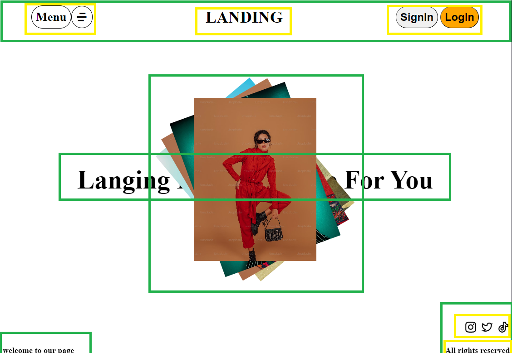

## Project1

Create a landing page
Goal:

Visulization help:

## What you will learn

- Position Property
  - Absolute
    - Top Bottom Left Right
  - Transation
- FlexBox
  - Display
  - align-item
    - Y-axis
      - Center Flex-start flex-end
  - justify-content
    - X-axis
      - center start end space-between space-around
    -
  - flex wrap

From Yt channel: Shreyansh coding school
