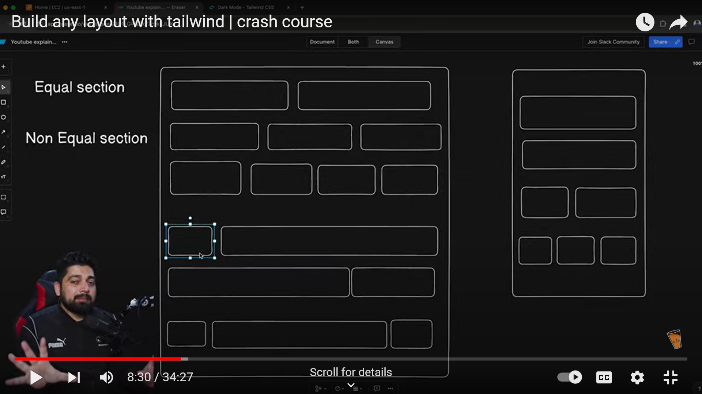

So 2 trh ke perspective hote hain
eek mobile basis pe and dusra laptop basis pe

Mobile me mostly sab one full width lete hain

Laptop me

- Equal Section
- Non Equal Section

# your task

# HACK-GRID

- for smaller screen we can set diff prop and on larger screen we can set diff prop
- Paret div ko grid kro and usme cheezen set kro samll ke liye using sm:
  and iske andr jobhi likhoge sab small screen ke liye hoga
- EG. sm:grid-cols-2 gap-4 m-4 => for small screen 2 cols bnado and unke beechme gap hoga 4 ka and margin hoga unke upar 4 ka
  ->Once the screen is 640px or wider, the grid will switch to a layout with 2 columns otherwise for smaller the default of 1 ke neech 1 lgega
- Agar chaliye hai ki hr time 1 ke bgl me 1 ho toh general bina sm ke same cheez likhdo

# For NON EQUAL

- designer tends to divide the screen to 12 columns and then span the child accordingly
- EG. for small screen and above simply divide the screen to 12 colms - Then do `col-span-2` for each items that is 2 portion taken by one item - how much space left for other cells = 12-2=10 `col-span-10` full line cover
- Now for smaller screen because as we shrink we want each cell to take full screen not just a 2 or 10 part of screen since the changes made in item not parent sm therefore
- define a defaul col prop in parent - if dont want one after the other {optional}
- define the span in items with sm

## GRID

[CONTAINER] : parent hota hai
[Grid ITEM]: Grid ke and ke items /direct descendent eg. parent div ke and ke div
[Grid Line] : lines that make up structure of grid can be vertical/horixpntal lines
[Grid cell]; space b/w 2 adjecent row amd 2 adj col / single unit of grid/single box
[Grid Track]: space inisde the cell/cell height
[Grid area]:space sorruounded with grid

## PROPS

### Parent

- display:grid :agar kuchbi na do to sab cell (i,0) me jata jayega same column diff row
  parent ko height and width :100% dene se vo full width and height le leta hai
- gap: gap deta hai child items ke bech me
  - row-gap
  - column-gap
- Grid-template-row :repeat(2,1fr); define kro kitni row hain ; 2 rows hain and per row 1fr i.e. fractional part of 100px
  1fr+1fr=2fr
  2fr=100px
  1fr=50px
  row1=50px
  row2=50px
  dimention ki agar parent 100px ka hai toh
- Grid-template-col : define kro kitni row hain

### CHILD

- justify-self: stretech, end,start cell ke andr child ko place krta hai //horizontal
- align-self: stretech, end,start cell ke andr child ko place krta hai //vertical
- place-self:stretch//height&width of child fix value na ho,center // vertical and horizontall

## ab agar 1 child ko full horizontal width chahiye hai 1 cell ki eg header then

- Grid-cloumn-start:1; column no 1 se
- Grid-cloumn-end:4; column no 4 tak
